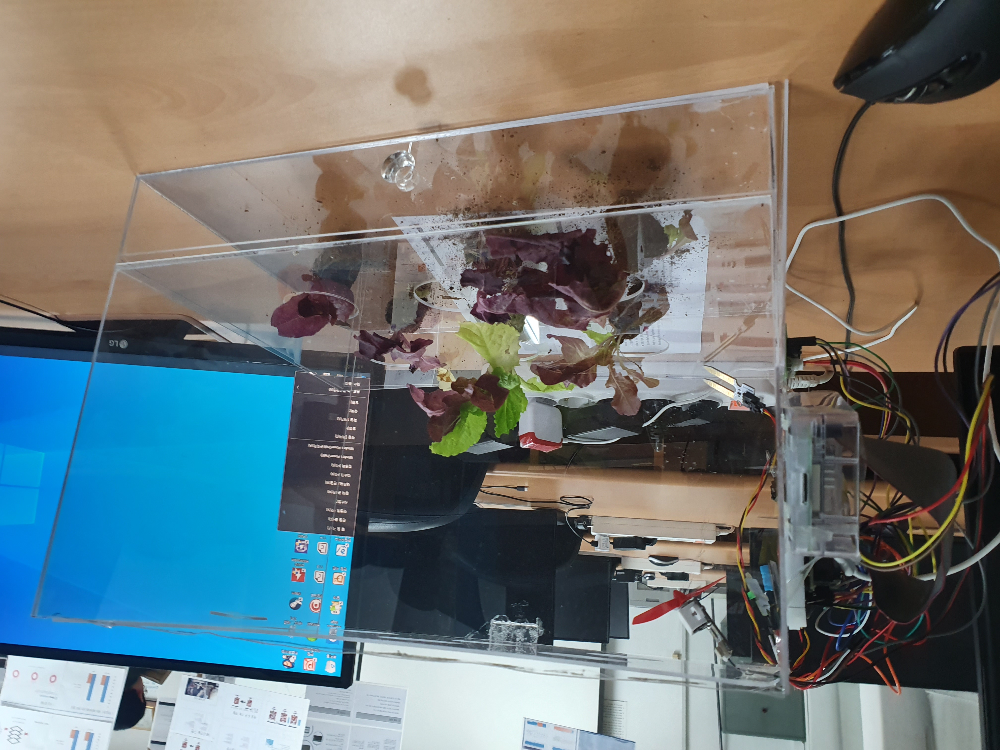

</img> 
# 스마트 팜 (라즈베리파이)

라즈베리파이와 각종 센서를 이용하여 자동 물주기, FAN(온도 맞추기용), 모터(창문열기), led(채광)를 구축하고 app과 소켓통신하여 센서를 제어하고 적용된 온도, 습도, 토양습도 값 변경

***

# 개발 환경

* 라즈비안   

* c언어   

* 센서 : 라즈베리파이3 b모델, Fan Module, Soil Moisture Sensor, Motor
Module, 5mm LED, Water Pump, Sensor Module(TEMP/ILLUM), Camera
Module, light sensor

***

# 기능소개

### `1. [ 스마트팜 목업]`   

 

### `2. [ 연결 확인 및 목업]`   

 

### `3. [ 각종 센서 연결 모습]`   

 

***

# 코드 소개

* dht11_read_val   

온습도 센서 제어   

* read_mcp3208_adc    

토양습도 제어 (mcp)    

* read_mcp3208_adc   

조도와 mcp 제어   

* forward, backward, setsteps, moter_sensor   

모터제어    

* fan_sensor   

FAN제어   

* pump_sensor   

펌프제어   

* light_sensor   

LED제어   

* main    

소켓통신 및 센서 제어 등   

